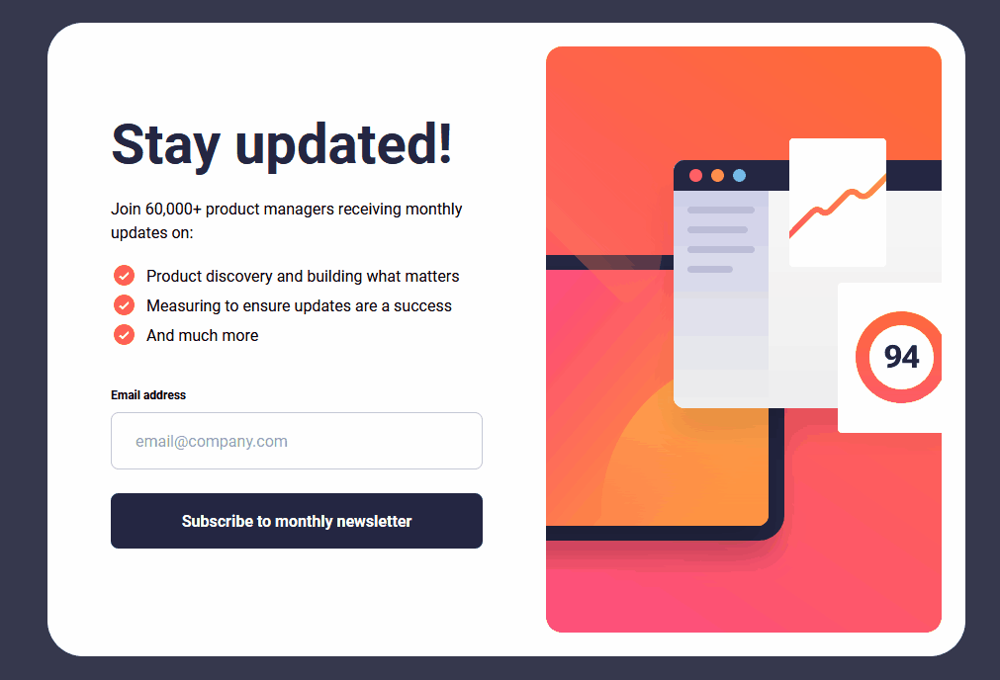

# Newsletter Sign Up Component

<div align="center"></div>

Design, assets, and requirements provided by [Frontend Mentor](https://www.frontendmentor.io/challenges/newsletter-signup-form-with-success-message-3FC1AZbNrv).

The requirement of this challenge is to create a newsletter sign up component that verifies a user's email, and displays a confirmation message that the user can dismiss. The component should also be responsive to be accessible and usable on various screen sizes.

This challenge was used to learn about TailWind CSS and begin implementing development tools such as `husky` and `lint-staged`.

## TechStack

This project was bootstrapped with [Vite](https://vitejs.dev/guide/) using the the React/Typescript template. The project is linted with [ESLint](https://eslint.org/docs/latest/user-guide/getting-started) using latest react, prettier, and [jsx-a11y](https://github.com/jsx-eslint/eslint-plugin-jsx-a11y) rules for syntax integrity. [lint-staged](https://github.com/okonet/lint-staged) and [husky](https://typicode.github.io/husky/) are used in conjunction to lint and format staged files before commits.

Some of the tools used in this project include:

- [Tailwind CSS](https://tailwindcss.com/docs)
- [React](https://react.dev/reference/react)
- [Typescript](https://www.typescriptlang.org/docs/)

A simple CI/CD process was created to lint the codebase before merging to the main branch and deploying to [Vercel](https://vercel.com/). The CI/CD process was creating with Github Actions and can be found in the `.github/workflows` directory.

## Installation

To run the application locally, please follow the steps below:

1. Ensure that [Git](https://git-scm.com/) is installed on your machine and on your machine run the `git clone https://github.com/JorgeAMendoza/newsletter-sign-up` command.
2. Navigate to the project directory with `cd newsletter-sign-up` and run the `npm install` command to install the project dependencies.
3. Run the `npm run dev` command to start the development server. The application will be running on `localhost:3000`.

To run the application in the production environment, run `npm run build` to build the application and then run `npm run preview` to preview the application on `localhost:3000`.

## Development

This section will cover the development process of the application and the challenges that were faced.

### Tailwind CSS

The main goal of this project was to get familiar with Tailwind CSS. Before attempting to use Tailwind CSS in a larger project, I at least wanted to learn how to properly use the tool in a small project. After reading the documentation for a bit and viewing some tutorials, I was able to get a basic understanding of how it works and apply the basics of it in my components.

See the `tailwind.config.js` code excrept below to see the customizations implemented:

```js
/** @type {import('tailwindcss').Config} */
export default {
  content: ['./index.html', './src/**/*.{js,jsx,ts,tsx}'],
  theme: {
    extend: {
      listStyleImage: {
        checkmark: 'url("/src/assets/images/icon-list.svg")',
      },
      borderRadius: {
        'card-tablet': '28px',
        'card-desktop': '36px',
      },
      fontSize: {
        xs: '.75rem',
        base: '1rem',
        lg: '1.125rem',
        xl: '1.25rem',
        '4xl': '2.5rem',
        'title-desktop': '3.5rem',
      },
      maxWidth: {
        desktop: '58rem',
        'desktop-image': '25rem',
      },
      height: {
        'card-desktop': '40.063rem',
        'confirmation-desktop': '32.5rem',
      },
      width: {
        'confirmation-desktop': '31.2rem',
      },
    },
    colors: {
      navy: {
        pale: '#36384D',
        dark: '#242742',
      },
      vermillion: {
        base: '#FF6155',
        light: 'rgba(255, 97, 85, .15)',
      },
      white: '#fff',
      grey: {
        25: 'rgba(25, 24, 43, 0.25)',
      },
    },
    container: {
      center: true,
      padding: {
        md: '2rem',
      },
    },
    fontFamily: {
      roboto: ['Roboto', 'sans-serif'],
    },
  },
  plugins: [],
}
```

As someone who has been writing CSS in awhile now (modules, scss, styled-components), working with Tailwind felt as if I had restrictions placed on me while styling. I do understand the use cases of tailwind, being able to have a set of ready to go classes and being able to customize these classes can get a project off the ground pretty fast, but I felt my workflow came to halt when trying to figure out the right classes to apply to an element. Even when I found the right class, I would have to modify it to match the Figma design. I'm not giving up on Tailwind, I know the more I use it the more comfortable and efficient i'll become with it, but my personal preference is still to write the CSS myself.

### Submitting the Form

I wasn't focused on making the form submission the best it can be, I simply used multiple states and mocked a _submission_ time to give off the feel of signing up for an email. See the `App.tsx` excerpt below:

```tsx
function App() {
  const email = useContext(EmailContext)
  const [signUpConfirmed, setSignUpConfirmed] = useState(false)
  const [confirmingEmail, setConfirmingEmail] = useState(false)

  useEffect(() => {
    if (signUpConfirmed) setConfirmingEmail(false)
  }, [signUpConfirmed])

  if (confirmingEmail) {
    return <ConfirmingEmail confirmSignUp={setSignUpConfirmed} />
  }

  if (signUpConfirmed) {
    return (
      <Confirmation
        email={email}
        reset={() => {
          setSignUpConfirmed(false)
        }}
      />
    )
  }
  ...
}
```

A email context is created to avoid passing down the email text to multiple components. The [`ConfirmingEmail.tsx`](./src/features/confirming-email/components/ConfirmingEmail.tsx) component is rendered when the user submits the form and the [`Confirmation.tsx`](./src/features/confirmation/components/Confirmation.tsx) component is rendered the mock _submission_ time is completed and displays a _thank you_ message.

After reviewing the project, I could have created a React Hook that contained the state and logic for the form submission. However, Tailwind was the focus of this project, so this works for now!

## Conclusion

Overall it was a good experience to work on this small project, I learned a lot about Tailwind CSS and feel that I can get comfortable working with it on larger projects. Writing CSS myself will always be my preference, especially when using the latest features, but it doesn't hurt to learn something new! If you read this far, thank you for checking out this pet project!
